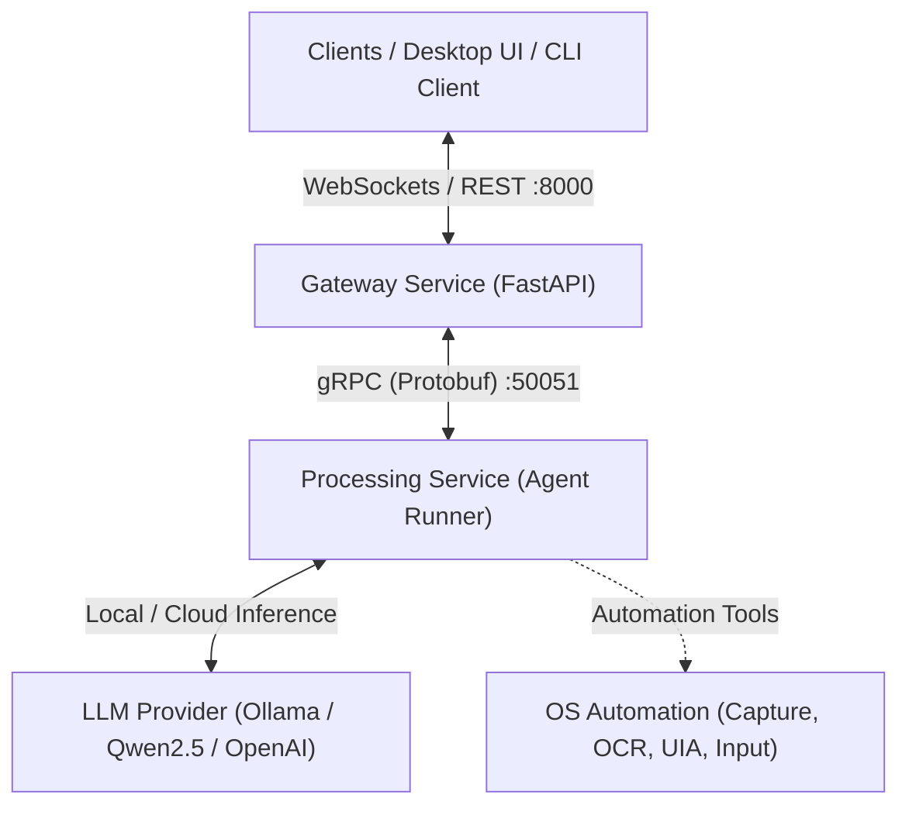

# Strata 🏔️

**Strata** is an extensible, local-first Windows AI Assistant and automation system built with high-performance Python microservices. It combines real-time multimodal OS automation (screen capture, OCR, UI automation) with local LLMs (Ollama, Qwen 2.5) and cloud LLM providers to execute complex desktop tasks.

---

## Architecture Overview

Strata is organized as a high-performance Python workspace (managed with [uv](https://github.com/astral-sh/uv)) composed of modular packages and microservices:



### Components

- **`services/gateway` (`strata-gateway`)**: FastAPI-based API Gateway handling REST endpoints and persistent WebSocket connections (`/ws/{session_id}`) for streaming bi-directional interactions.
- **`services/processing` (`strata-processing`)**: High-performance gRPC agent runner (`AgentService`) that handles task streaming, LLM reasoning, LangGraph agent workflows, and tool execution.
- **`packages/core` (`strata-core`)**: Shared foundations including Pydantic settings, event data structures (`BaseEvent`, `AgentActionEvent`, `HITLRequestEvent`), Loguru logging, and LLM provider interfaces.
- **`packages/os_automation` (`strata-os`)**: Windows OS automation primitives including high-fps screen capture (`bettercam`), native Windows OCR (`winsdk`), UI automation (`pywinauto`), and input simulation.
- **`packages/protocols` (`strata-protocols`)**: gRPC protocol buffer definitions (`agent_service.proto`) and generated Python stubs for inter-service communication.

---

## Repository Structure

```text
Strata/
├── packages/
│   ├── core/                  # Shared settings, event schemas, logging & LLM clients
│   ├── os_automation/         # Windows screen capture, OCR, UIA, & window management
│   └── protocols/             # Protocol Buffers (.proto) definitions & generated stubs
├── services/
│   ├── gateway/               # FastAPI gateway & WebSocket connection manager
│   └── processing/            # gRPC agent service running LLMs & tool loops
├── cli_client.py              # Interactive terminal WebSocket client for testing
├── generate_protos.py         # Code generator for gRPC Protobuf stubs
├── start_all.py               # Orchestrator script to start Gateway + Processing
├── start_gateway.py           # Standalone launcher for Gateway
├── start_processing.py        # Standalone launcher for Processing
├── pyproject.toml             # Root uv workspace configuration
└── uv.lock                    # Dependency lockfile
```

---

## Getting Started

### Prerequisites

- **OS**: Windows 10 or 11 (required for Windows OCR, UIA, and DXGI screen capture)
- **Python**: 3.12+
- **Package Manager**: [uv](https://github.com/astral-sh/uv) (recommended)
- **LLM Engine**: [Ollama](https://ollama.com/) (e.g. running `ollama run qwen2.5:7b`) or an OpenAI-compatible API endpoint

### 1. Installation

Clone the repository and install all workspace dependencies using `uv`:

```powershell
git clone https://github.com/HarelZadok/Strata.git
cd Strata

# Sync workspace dependencies into a virtual environment
uv sync
```

### 2. Generate gRPC Protobufs

Compile the protocol buffer specifications into Python stubs:

```powershell
uv run python generate_protos.py
```

### 3. Configuration

Strata uses environment variables prefixed with `STRATA_` (or a `.env` file in the root):

| Environment Variable | Default | Description |
|----------------------|---------|-------------|
| `STRATA_GATEWAY_HOST` | `127.0.0.1` | Gateway bind host |
| `STRATA_GATEWAY_PORT` | `8000` | Gateway HTTP/WebSocket port |
| `STRATA_GRPC_PORT` | `50051` | gRPC service port |
| `STRATA_LLM_PROVIDER_MODE` | `local` | LLM mode (`local`, `cloud`, `remote`) |
| `STRATA_LLM_BASE_URL` | `http://localhost:11434/v1` | LLM API base URL (Ollama default) |
| `STRATA_LLM_MODEL` | `qwen2.5:7b` | LLM model identifier |
| `STRATA_LLM_API_KEY` | `None` | API key (optional for local Ollama) |

---

## Running Strata

### Option A: Start All Services (Recommended)

To launch both the Processing Service (gRPC) and the Gateway Service (FastAPI):

```powershell
uv run python start_all.py
```

### Option B: Start Services Individually

In terminal 1:
```powershell
uv run python start_processing.py
```

In terminal 2:
```powershell
uv run python start_gateway.py
```

---

## Testing & Interacting

### Interactive CLI Client

Once services are running, launch the interactive WebSocket client to chat with Strata in real-time:

```powershell
uv run python cli_client.py
```

### Testing OS Automation

To visually test window focus, typing via `WM_CHAR` bypasses, and 4-layer fallback desktop capture:

```powershell
uv run python .local/scripts/test_os_automation.py
```

---

## Development

- **Format & Lint**:
  ```powershell
  uv run ruff check .
  ```
- **Type Checking**:
  ```powershell
  uv run mypy .
  ```